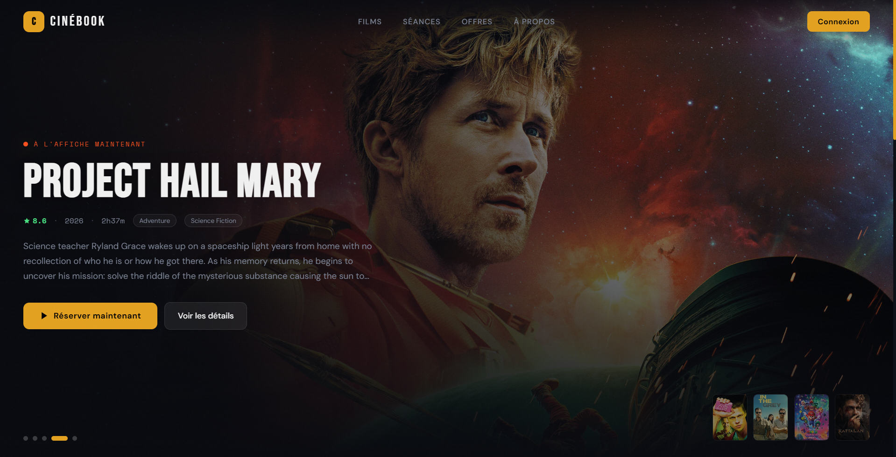
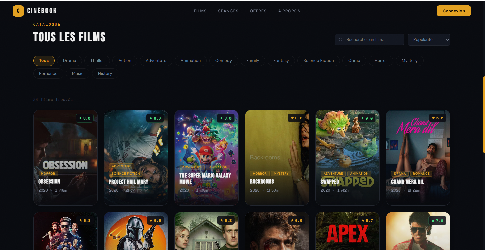
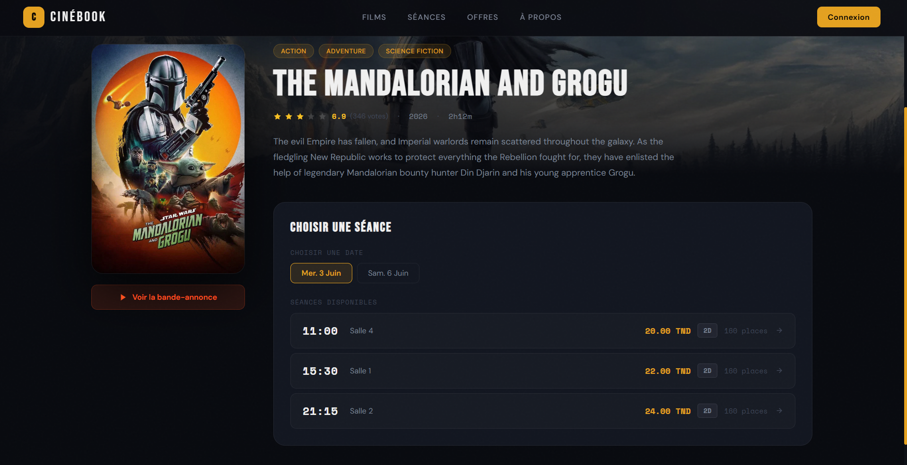
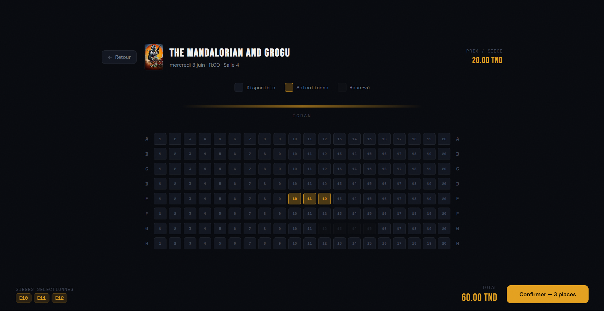
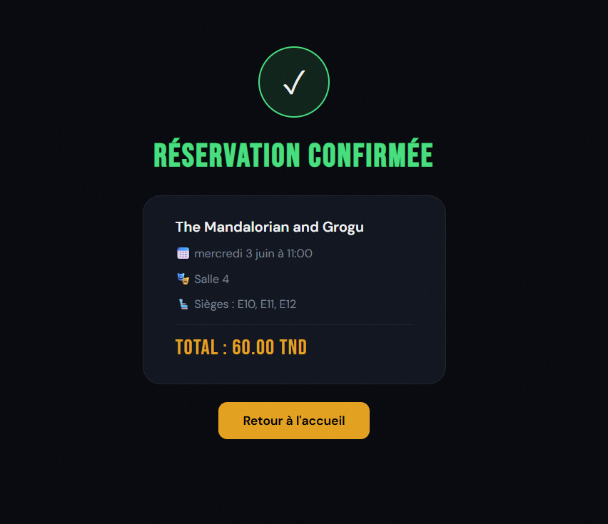
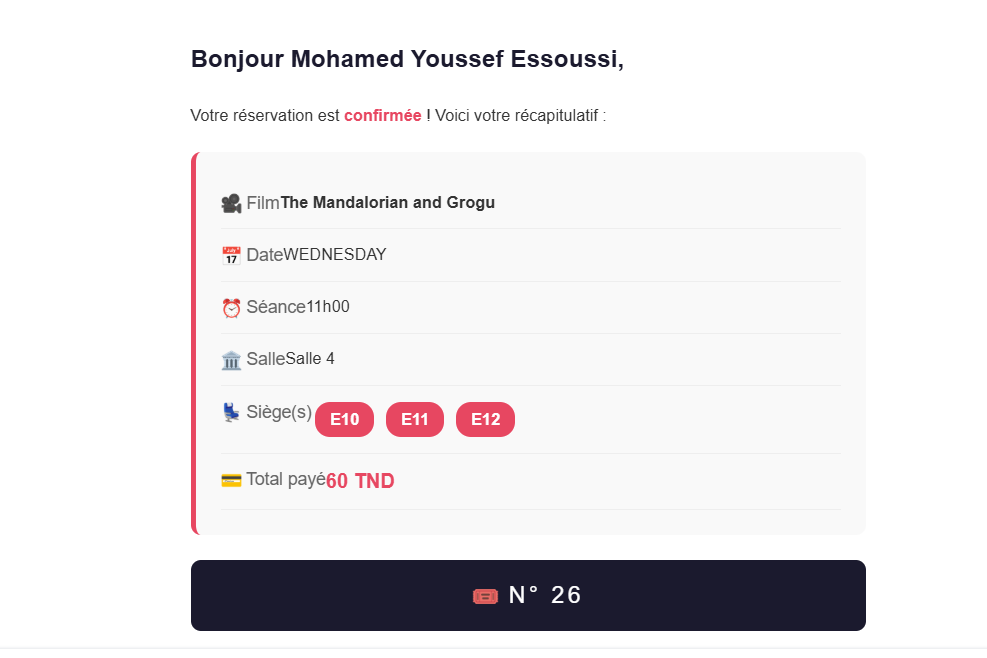

# CineBook — Online Cinema Booking Platform

A full-stack web application for cinema management and online movie reservations. Users can browse movies, select seats, book tickets, and receive email confirmations. Movie data is synchronized automatically from the TMDB API.

> **Stack:** Spring Boot · React (Vite) · PostgreSQL · Docker · JWT · TMDB API

---

## Features

- **Authentication** — Registration, login, JWT-based auth, role-based access (Spring Security)
- **Movie Catalog** — TMDB API integration with automated database synchronization (Now Playing, Upcoming…)
- **Reservation System** — Seat selection, availability validation, booking history per user
- **Email Notifications** — Async confirmation emails with full booking details after each reservation

---

##Architecture

```
┌─────────────────┐        REST API (JWT)       ┌──────────────────────┐
│  React (Vite)   │ ◄─────────────────────────► │  Spring Boot API     │
│  Frontend       │                              │  Backend             │
└─────────────────┘                              └──────────┬───────────┘
                                                            │
                                              ┌─────────────▼────────────┐
                                              │      PostgreSQL DB        │
                                              └──────────────────────────┘
                                                            │
                                              ┌─────────────▼────────────┐
                                              │     TMDB External API     │
                                              └──────────────────────────┘
```

All services are containerized and orchestrated with **Docker Compose**.

---

## Getting Started

### Prerequisites

- [Docker](https://www.docker.com/) & Docker Compose
- A [TMDB API key]
- A Gmail account with an [App Password] for email notifications

### 1. Clone the repository

```bash
git clone https://github.com/myessoussi-dev/CineBook.git
cd cinebook
```

### 2. Configure environment variables

Create a `.env` file at the root (see `.env.example`):

```env
API_KEY=your_tmdb_api_key

SPRING_DATASOURCE_USERNAME=postgres
SPRING_DATASOURCE_PASSWORD=your_password

SECRET_KEY=your_jwt_secret_key

MAIL=your_email@gmail.com
MAIL_PASSWORD=your_gmail_app_password
```

---

### 3. Run with Docker Compose

To start:

```bash
docker compose up --build
```

To stop:

```bash
docker compose down
```

---

## Main Workflow

```
User selects movie & session
        ↓
Seat selection (real-time availability)
        ↓
Reservation request → Backend validates & stores
        ↓
Async confirmation email sent to user
```

Movie data is fetched from TMDB and synchronized into the local database automatically on startup.

---

##Tech Stack

| Layer    | Technology                         |
|----------|------------------------------------|
| Frontend | React, Vite, JavaScript            |
| Backend  | Java, Spring Boot, Spring Security |
| Auth     | JWT                                |
| Database | PostgreSQL, JPA / Hibernate        |
| Email    | JavaMailSender, SMTP (async)       |
| External | TMDB API                           |
| DevOps   | Docker, Docker Compose             |
| Build    | Maven                              |

---

## Security

- Stateless JWT authentication
- Spring Security filters on all protected endpoints
- Passwords hashed with BCrypt
- All sensitive credentials via environment variables (never committed)

---

## Screenshots

| | |
|:---:|:---:|
|  |  |
| **Home Page** | **All Movies** |
|  |  |
| **Available Sessions** | **Seat Selection** |
|  |  |
| **Booking Confirmation** | **Confirmation Email** |

---

## Author

**Youssef Essoussi**  
**INSAT software engineering student**
